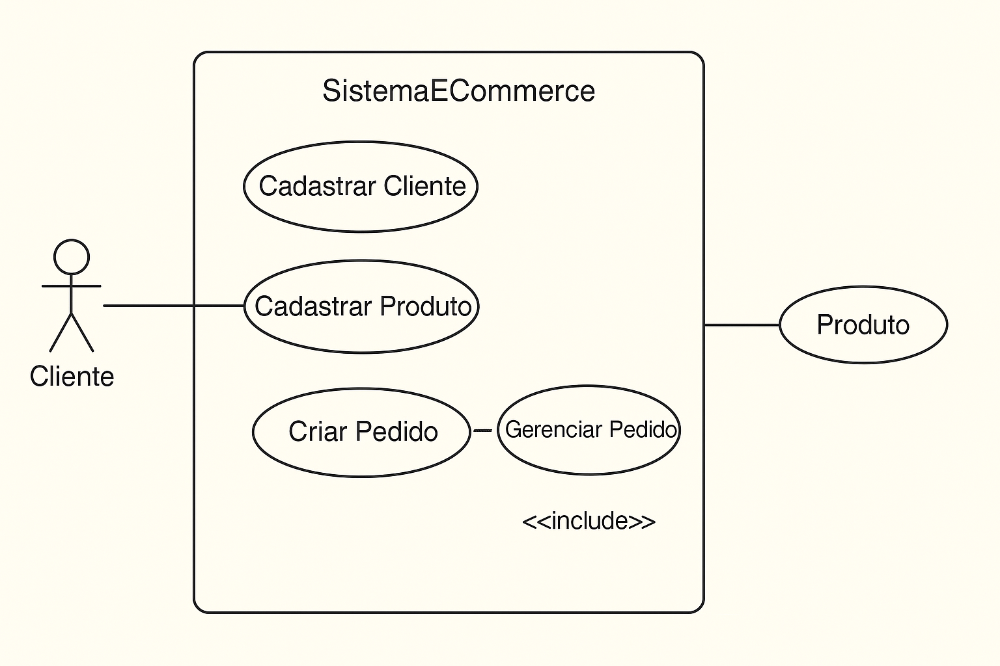

# 🏗️ Estrutura do Repositório

## 📂 Java Clasico
Projeto em Java clássico - E-commerce tradicional

## 📂 Java 8 Prog Funcional  
Projeto em Java 8 - E-commerce com programação funcional

### 🛒 Sistema de E-Commerce em Java Clásico (Console)

Este projeto é um **sistema simples de E-Commerce**, sem banco de dados.

           +----------------------+
           |      Cliente         |
           +----------------------+
                  /       \
                 /         \
                ↓           ↓
       +----------------+   +-------------------+
       |  Gerenciar     |   |  Realizar Pedido  |
       |  Cadastro      |   +-------------------+
       +----------------+          |
                                   ↓
                           +--------------------+
                           | Sistema E-Commerce |
                           +--------------------+
                             /        |         \
                            /         |          \
                           ↓          ↓           ↓
                 +---------------+ +---------------+ +----------------+
                 |  Adicionar    | |  Finalizar    | |  Efetuar       |
                 |  Itens        | |  Pedido       | |  Pagamento     |
                 +---------------+ +---------------+ +----------------+
                                                 \
                                                  ↓
                                             +----------------+
                                             |  Entregar      |
                                             |  Pedido        |
                                             +----------------+

---

### 🚀 Funcionalidades

#### Clientes
- Cadastrar clientes (verificação de maioridade)
- Listar clientes cadastrados
- Atualizar dados (sem exclusão)

#### Produtos
- Cadastrar novos produtos
- Listar produtos cadastrados
- Atualizar dados (sem exclusão)

#### Pedidos
- Criar pedidos para clientes
- Adicionar/Remover itens (com preço e quantidade)
- Alterar quantidade
- Finalizar, pagar e entregar pedidos
- Notificação simulada por e-mail no console

#### Demonstração Automática
- Há uma opção **"Exemplo de Caso de Uso"** que executa automaticamente um fluxo completo:
  1. Criação de cliente e produtos  
  2. Criação de pedido  
  3. Adição de itens  
  4. Finalização, pagamento e entrega  

---

### 🧩 Estrutura de Classes

| Classe | Responsabilidade |
|--------|------------------|
| `Cliente` | Armazena dados de clientes e valida maioridade |
| `Produto` | Representa um produto do catálogo |
| `ItemPedido` | Liga produtos a pedidos com quantidade e preço de venda |
| `Pedido` | Controla status (Aberto, Aguardando Pagamento, Pago, Finalizado) e operações de venda |
| `SistemaECommerce` | Ponto de entrada (`main`) e menu de operações |

---

### 🧠 Regras de Negócio

- Todo cliente deve ter documento de identificação e ser **maior de idade**  
- Pedido inicia com **status = "Aberto"**  
- Apenas pedidos abertos podem receber, alterar ou remover itens  
- Pedido precisa ter **ao menos um item** e **valor total > 0** para ser finalizado  
- Após finalização → status muda para **"Aguardando pagamento"**  
- Após pagamento → status muda para **"Pago"**  
- Após entrega → status muda para **"Finalizado"**  
- Notificações são simuladas via mensagens no console  

---

===== MENU PRINCIPAL =====
1. Clientes
2. Produtos
3. Pedidos
4. Exemplo de Caso de Uso
0. Sair

## E-commerce Console (Java 8 funcional)

### Descrição
Sistema simples de e-commerce rodando no console, usando Java 8 (Streams, Optional, Lambdas) e POO.  
Funcionalidades: cadastro de clientes (verifica maioridade), cadastro de produtos, criação e gerenciamento de pedidos (adicionar/remover itens, finalizar, pagar, entregar), e demonstração automática.

### Estrutura
- Cliente.java
- Produto.java
- ItemPedido.java
- Pedido.java
- SistemaECommerce.java

